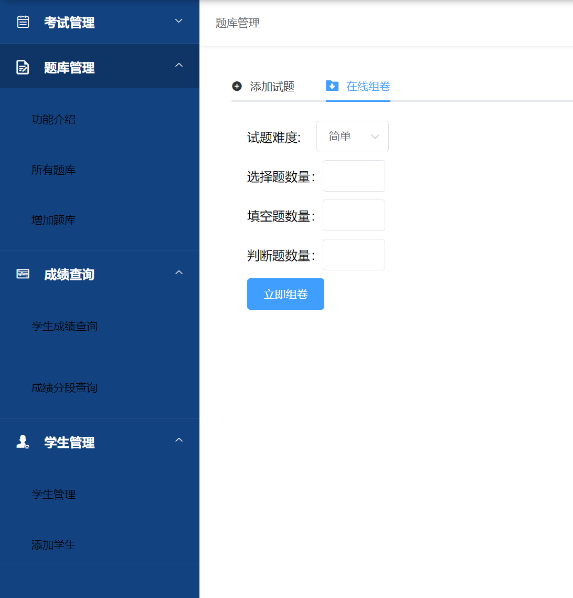

# <center>小济在线考试系统 – 实验报告</center>

- 学号：1951976
- 姓名：李林飞

[TOC]

## 1. 实验要求

- **功能1**

开发用户注册和登录模块，不同的用户对数据库有不同的操作权限（浏览数据库和编辑数据库)。（提示：在注册时将有关信息保存到数据库中；当再次登录时，根据用户输入的用户名和密码在数据库中查找，不同的用户给出不同的页面进行操作。)

- **功能2**

开发一个简单的在线考试程序，可以包括若干道单选题、多选题，单击交卷按钮后就可以根据标准答案在线评分。

- **功能3**

开发一个页面，当客户第一次访问时，需在线注册姓名、性别等信息，然后将信息保存到Cookies中，当下次如该用户再访问，则显示“某某，您好，您是第几次光临本站”的欢迎信息。


## 2. 系统设计实现

### 2.1 数据库的设计

#### 2.1.1 数据库ER图设计

数据库设计比较简单，没有严格遵守第三范式。为了简化问题，对传统的线上考试系统做了以下简化：

- 所有的考试题都是共有的，相当于一个题库，老师是题库的提供者，但不与试题进行关联。
- 学生是刷题者，与老师没有直接的关联关系。本身具有分数、参与哪次考试的关联信息。
- 一场考试对应一张试卷，一张试卷有三种题型组成：选择题、判断题、填空题。
- 超级管理员与具体实体类没有关联关系，只是在权限上提供更多操作。
- 学生留言区提供自由式评论与留言，不记录留言和发表评论的人。
- 不记录学生考试选择的选项，每个试题中有答案，学生作答后在前端计算总分。


#### 2.1.2 数据库表设计

- 管理员信息表

| Field     | Type        | Collation | Null | Key  | Default | Comment                     |
| --------- | ----------- | --------- | ---- | ---- | ------- | --------------------------- |
| adminId   | int(9)      | (NULL)    | NO   | PRI  | (NULL)  | ID号                        |
| adminName | varchar(20) | utf8_bin  | YES  |      | (NULL)  | 姓名                        |
| sex       | varchar(2)  | utf8_bin  | YES  | MUL  | (NULL)  | 性别                        |
| tel       | varchar(11) | utf8_bin  | YES  |      | (NULL)  | 电话号码                    |
| email     | varchar(20) | utf8_bin  | YES  |      | (NULL)  | 电子邮箱                    |
| pwd       | varchar(16) | utf8_bin  | YES  |      | (NULL)  | 密码                        |
| cardId    | varchar(18) | utf8_bin  | YES  |      | (NULL)  | 身份证号                    |
| role      | varchar(1)  | utf8_bin  | YES  |      | (NULL)  | 角色(0管理员，1教师，2学生) |

- 考试管理表

| Field       | Type         | Collation | Null | Key  | Default | Comment      |
| ----------- | ------------ | --------- | ---- | ---- | ------- | ------------ |
| examCode    | int(9)       | (NULL)    | NO   | PRI  | (NULL)  | 考试编号     |
| description | varchar(50)  | utf8_bin  | YES  |      | (NULL)  | 该次考试介绍 |
| source      | varchar(20)  | utf8_bin  | YES  |      | (NULL)  | 课程名称     |
| paperId     | int(10)      | (NULL)    | YES  |      | (NULL)  | 试卷编号     |
| examDate    | varchar(10)  | utf8_bin  | YES  |      | (NULL)  | 考试日期     |
| totalTime   | int(3)       | (NULL)    | YES  |      | (NULL)  | 持续时长     |
| grade       | varchar(10)  | utf8_bin  | YES  |      | (NULL)  | 年级         |
| term        | varchar(10)  | utf8_bin  | YES  |      | (NULL)  | 学期         |
| major       | varchar(20)  | utf8_bin  | YES  |      | (NULL)  | 专业         |
| institute   | varchar(20)  | utf8_bin  | YES  |      | (NULL)  | 学院         |
| totalScore  | int(4)       | (NULL)    | YES  |      | (NULL)  | 总分         |
| type        | varchar(255) | utf8_bin  | YES  |      | (NULL)  | 考试类型     |
| tips        | varchar(255) | utf8_bin  | YES  |      | (NULL)  | 考生须知     |

- 填空题表

| Field      | Type         | Collation | Null | Key  | Default | Comment  |
| ---------- | ------------ | --------- | ---- | ---- | ------- | -------- |
| questionId | int(9)       | (NULL)    | NO   | PRI  | (NULL)  | 试题编号 |
| subject    | varchar(20)  | utf8_bin  | YES  |      | (NULL)  | 考试科目 |
| question   | varchar(255) | utf8_bin  | YES  |      | (NULL)  | 试题内容 |
| answer     | varchar(255) | utf8_bin  | YES  |      | (NULL)  | 正确答案 |
| analysis   | varchar(255) | utf8_bin  | YES  |      | (NULL)  | 题目解析 |
| score      | int(2)       | (NULL)    | YES  |      | 2       | 分数     |
| level      | varchar(5)   | utf8_bin  | YES  |      | (NULL)  | 难度等级 |
| section    | varchar(20)  | utf8_bin  | YES  |      | (NULL)  | 所属章节 |

- 判断题表

| Field      | Type         | Collation | Null | Key  | Default | Comment  |
| ---------- | ------------ | --------- | ---- | ---- | ------- | -------- |
| questionId | int(9)       | (NULL)    | NO   | PRI  | (NULL)  | 试题编号 |
| subject    | varchar(20)  | utf8_bin  | YES  |      | (NULL)  | 考试科目 |
| question   | varchar(255) | utf8_bin  | YES  |      | (NULL)  | 试题内容 |
| answer     | varchar(255) | utf8_bin  | YES  |      | (NULL)  | 正确答案 |
| analysis   | varchar(255) | utf8_bin  | YES  |      | (NULL)  | 题目解析 |
| score      | int(2)       | (NULL)    | YES  |      | 2       | 分数     |
| level      | varchar(1)   | utf8_bin  | YES  |      | (NULL)  | 难度等级 |
| section    | varchar(20)  | utf8_bin  | YES  |      | (NULL)  | 所属章节 |

- 留言表

| Field      | Type         | Collation | Null | Key  | Default | Comment  |
| ---------- | ------------ | --------- | ---- | ---- | ------- | -------- |
| questionId | int(9)       | (NULL)    | NO   | PRI  | (NULL)  | 试题编号 |
| subject    | varchar(20)  | utf8_bin  | YES  |      | (NULL)  | 考试科目 |
| question   | varchar(255) | utf8_bin  | YES  |      | (NULL)  | 试题内容 |
| answer     | varchar(255) | utf8_bin  | YES  |      | (NULL)  | 正确答案 |
| analysis   | varchar(255) | utf8_bin  | YES  |      | (NULL)  | 题目解析 |
| score      | int(2)       | (NULL)    | YES  |      | 2       | 分数     |
| level      | varchar(1)   | utf8_bin  | YES  |      | (NULL)  | 难度等级 |
| section    | varchar(20)  | utf8_bin  | YES  |      | (NULL)  | 所属章节 |

- 评论回复表

| Field        | Type   | Collation | Null | Key  | Default | Comment  |
| ------------ | ------ | --------- | ---- | ---- | ------- | -------- |
| paperId      | int(9) | (NULL)    | YES  |      | (NULL)  | 试卷编号 |
| questionType | int(1) | (NULL)    | YES  |      | (NULL)  | 题目类型 |
| questionId   | int(9) | (NULL)    | YES  |      | (NULL)  | 题目编号 |

- 选择题表

| Field       | Type         | Collation | Null | Key  | Default | Comment  |
| ----------- | ------------ | --------- | ---- | ---- | ------- | -------- |
| questionId  | int(9)       | (NULL)    | NO   | PRI  | (NULL)  | 试题编号 |
| subject     | varchar(20)  | utf8_bin  | YES  |      | (NULL)  | 考试科目 |
| question    | varchar(255) | utf8_bin  | YES  |      | (NULL)  | 问题题目 |
| answerA     | varchar(255) | utf8_bin  | YES  |      | (NULL)  | 选项A    |
| answerB     | varchar(255) | utf8_bin  | YES  |      | (NULL)  | 选项B    |
| answerC     | varchar(255) | utf8_bin  | YES  |      | (NULL)  | 选项C    |
| answerD     | varchar(255) | utf8_bin  | YES  |      | (NULL)  | 选项D    |
| rightAnswer | varchar(10)  | utf8_bin  | YES  |      | (NULL)  | 正确答案 |
| analysis    | varchar(255) | utf8_bin  | YES  |      | (NULL)  | 题目解析 |
| score       | int(2)       | (NULL)    | YES  |      | 2       | 分数     |
| section     | varchar(20)  | utf8_bin  | YES  |      | (NULL)  | 所属章节 |
| level       | varchar(1)   | utf8_bin  | YES  |      | (NULL)  | 难度等级 |

- 试卷表

| Field        | Type   | Collation | Null | Key  | Default | Comment  |
| ------------ | ------ | --------- | ---- | ---- | ------- | -------- |
| paperId      | int(9) | (NULL)    | YES  |      | (NULL)  | 试卷编号 |
| questionType | int(1) | (NULL)    | YES  |      | (NULL)  | 题目类型 |
| questionId   | int(9) | (NULL)    | YES  |      | (NULL)  | 题目编号 |

- 成绩表

| Field      | Type        | Collation | Null | Key  | Default | Comment  |
| ---------- | ----------- | --------- | ---- | ---- | ------- | -------- |
| scoreId    | int(9)      | (NULL)    | NO   | PRI  | (NULL)  | 分数编号 |
| examCode   | int(9)      | (NULL)    | YES  |      | (NULL)  | 考试编号 |
| studentId  | int(9)      | (NULL)    | YES  |      | (NULL)  | 学号     |
| subject    | varchar(20) | utf8_bin  | NO   |      | (NULL)  | 课程名称 |
| ptScore    | int(5)      | (NULL)    | YES  |      | (NULL)  | 平时成绩 |
| etScore    | int(5)      | (NULL)    | YES  |      | (NULL)  | 期末成绩 |
| score      | int(5)      | (NULL)    | YES  |      | (NULL)  | 总成绩   |
| answerDate | varchar(10) | utf8_bin  | YES  |      | (NULL)  | 答题日期 |

- 学生信息表

| Field       | Type        | Collation | Null | Key  | Default | Comment                     |
| ----------- | ----------- | --------- | ---- | ---- | ------- | --------------------------- |
| studentId   | int(9)      | (NULL)    | NO   | PRI  | (NULL)  | ID                          |
| studentName | varchar(20) | utf8_bin  | YES  |      | (NULL)  | 姓名                        |
| grade       | varchar(4)  | utf8_bin  | YES  |      | (NULL)  | 年级                        |
| major       | varchar(20) | utf8_bin  | YES  |      | (NULL)  | 专业                        |
| clazz       | varchar(10) | utf8_bin  | YES  |      | (NULL)  | 班级                        |
| institute   | varchar(30) | utf8_bin  | YES  |      | (NULL)  | 学院                        |
| tel         | varchar(11) | utf8_bin  | YES  |      | (NULL)  | 电话号码                    |
| email       | varchar(30) | utf8_bin  | YES  |      | (NULL)  | 电子邮件                    |
| pwd         | varchar(16) | utf8_bin  | YES  |      | (NULL)  | 密码                        |
| cardId      | varchar(18) | utf8_bin  | YES  |      | (NULL)  | 身份证号                    |
| sex         | varchar(2)  | utf8_bin  | YES  |      | (NULL)  | 性别                        |
| role        | varchar(1)  | utf8_bin  | YES  |      | 2       | 角色(0管理员，1教师，2学生) |

- 教师信息表

| teacherId   | int(9)      | (NULL)   | NO   | PRI  | (NULL) | ID                            |
| ----------- | ----------- | -------- | ---- | ---- | ------ | ----------------------------- |
| teacherName | varchar(20) | utf8_bin | YES  |      | (NULL) | 姓名                          |
| institute   | varchar(20) | utf8_bin | YES  |      | (NULL) | 学院                          |
| sex         | varchar(2)  | utf8_bin | YES  |      | (NULL) | 性别                          |
| tel         | varchar(11) | utf8_bin | YES  |      | (NULL) | 电话号码                      |
| email       | varchar(20) | utf8_bin | YES  |      | (NULL) | 邮箱                          |
| pwd         | varchar(16) | utf8_bin | YES  |      | (NULL) | 密码                          |
| cardId      | varchar(18) | utf8_bin | YES  |      | (NULL) | 身份证号                      |
| type        | varchar(20) | utf8_bin | YES  |      | (NULL) | 职称                          |
| role        | varchar(1)  | utf8_bin | YES  |      | (NULL) | 角色（0管理员，1教师，2学生） |


### 2.2 后端设计与实现

后端主要使用SpringBoot+MyBatisPLUS+MySQL实现。业务逻辑大都是增删改查，并不复杂。集成Swagger3.0创建接口文档。技术栈：

- SpringBoot 2.6.7
- MyBatisPLUS: 
- MySQL: 5.7
- Swagger:  3.0
- Java: 1.8

#### 2.2.1 项目配置

- 数据库连接配置

```java
# 数据库配置 MySQL 5.7
spring.datasource.username=root
spring.datasource.password=123456
spring.datasource.url=jdbc:mysql://localhost:3306/xiaoji_exam?useUnicode=true&characterEncoding=UTF-8&useSSL=false&serverTimezone=UTC
spring.datasource.driver-class-name=com.mysql.cj.jdbc.Driver
spring.datasource.type=com.alibaba.druid.pool.DruidDataSource
```

- 配置MyBatisPLUS做分页查询

```java
@EnableTransactionManagement
@Configuration
@MapperScan("com.exam.mapper")
public class MybatisPlusConfig {
    /**
     * 新的分页插件,一缓和二缓遵循mybatis的规则,需要设置 MybatisConfiguration#useDeprecatedExecutor = false 避免缓存出现问题(该属性会在旧插件移除后一同移除)
     */
    @Bean
    public MybatisPlusInterceptor mybatisPlusInterceptor() {
        MybatisPlusInterceptor interceptor = new MybatisPlusInterceptor();
        interceptor.addInnerInterceptor(new PaginationInnerInterceptor(DbType.H2));
        return interceptor;
    }
}
```

- 配置Swagger接口文档: 访问地址：http://localhost:8080/swagger-ui/index.html

```java
@Configuration
@EnableOpenApi
public class SwaggerConfig {
    @Bean
    public Docket docket(){
        return new Docket(DocumentationType.OAS_30)
                .apiInfo(apiInfo()).enable(true)
                .select()
                //apis： 添加swagger接口提取范围
                .apis(RequestHandlerSelectors.basePackage("com.exam"))
                //.apis(RequestHandlerSelectors.withMethodAnnotation(ApiOperation.class))
                .paths(PathSelectors.any())
                .build();
    }

    private ApiInfo apiInfo(){
        return new ApiInfoBuilder()
                .title("小济线上考试项目接口文档")
                .description("基于SpringBoot的在线考试系统")
                .contact(new Contact("1951976 李林飞", "https://github.com/lif314", "1951976@tongji.edu.cn"))
                .version("1.0")
                .build();
    }
}
```

#### 2.2.2 业务逻辑 (以在线评分为例)

- 当学生查询在考试页面中点击某一场考试：后端在conteoller中接口查询试卷试题的请求。由于一套试卷是由不同数量的选择题、填空题和判断题构成，所以通过关联关系查询到具体的试题信息。试题信息中包含题目本身以及试题答案。

```java
    @ApiOperation("根据试卷id查询试卷信息")
    @GetMapping("/paper/{paperId}")
    public Map<Integer, List<?>> findById(@PathVariable("paperId") Integer paperId) {
        List<MultiQuestion> multiQuestionRes = multiQuestionService.findByIdAndType(paperId);   //选择题题库 1
        List<FillQuestion> fillQuestionsRes = fillQuestionService.findByIdAndType(paperId);     	//填空题题库 2
        List<JudgeQuestion> judgeQuestionRes = judgeQuestionService.findByIdAndType(paperId);   //判断题题库 3
        Map<Integer, List<?>> map = new HashMap<>();
        map.put(1,multiQuestionRes);
        map.put(2,fillQuestionsRes);
        map.put(3,judgeQuestionRes);
        return  map;
    }
```

- 前端接受到试题信息渲染在页面上，然后通过比对用户输入与试题的答案进行评分。并实时显示考试总分。
- 当接受考试时，前端向后端发送添加考试成绩信息的请求

```java
    @ApiOperation("添加学生成绩")
    @PostMapping("/score")
    public ApiResult add(@RequestBody Score score) {
        int res = scoreService.add(score);
        if (res == 0) {
            return ApiResultHandler.buildApiResult(400,"成绩添加失败",res);
        }else {
            return ApiResultHandler.buildApiResult(200,"成绩添加成功",res);
        }
    }
```

- 该请求在controller中接受，在service中处理

```java
	@Override
    public int add(Score score) {
        return scoreMapper.add(score);
    }
```

- 通过MyBatisPLUS，会映射到一个Mapper上

```java
    /**
     * @param score 添加一条成绩记录
     */
    @Options(useGeneratedKeys = true,keyProperty = "scoreId")
    @Insert("insert into score(examCode,studentId,subject,ptScore,etScore,score,answerDate) values(#{examCode},#{studentId},#{subject},#{ptScore},#{etScore},#{score},#{answerDate})")
    int add(Score score);
```

- MyBatisPLUS根据mapper与数据库进行连接，并完成注解上的操作。

> 其余业务逻辑都差不多。同时，MybatisPLUS提供了分页查询机制。


#### 2.2.3 Swagger接口文档


- 栗子【考试管理接口】


### 2.3 前端设计与实现

前端主要采用Vue和ElemetUI进行开发，完成项目要求。同时扩展了一些功能，但部分界面上的功能还没有实现。

前端技术栈：

- Vue@2
- Vuex@3
- VueRouter
- VueCookies
- ElementUI
- axios
- echarts

#### 2.3.1 登录与注册

由于是在线考试系统，以学生管理系统作为参考，学生注册功能改为由管理员发放账号(学号)。学生可以自己的密码等，但不能修改账号。

对于学生、教师和管理员，我通过实体类中的`role`字段进行判断：0管理员，1教师，2学生。前端根据用户输入的账号向后端发送请求获取用户的完整信息，然后根据`role`字段判断用户角色，然后使用VueRouter进行路由跳转，不同角色的用户在不同的页面中进行操作。

```js
if (resData != null) {
          switch (resData.role) {
            case "0": //管理员
              this.$router.push({ path: "/index" }); //跳转到首页
              break;
            case "1": //教师
              this.$router.push({ path: "/index" }); //跳转到教师用户
              break;
            case "2": //学生
              this.$router.push({ path: "/student" });
              break;
          }
        }
```

- 登录界面


- 学生登录


- 管理员登录


- 教师登录


- 管理员或教师创建学生初始账号


- 创建结果


#### 2.3.2 使用Cookies保存用户信息

- 当用户登陆时，可以使用Vue-Cookies存储用户信息

```js
if (resData != null) {
          switch (resData.role) {
            case "0": //管理员
              this.$cookies.set("cname", resData.adminName);
              this.$cookies.set("cid", resData.adminId);
              this.$cookies.set("role", 0);
              this.countLoginNum(resData.adminName);
              this.$router.push({ path: "/index" }); //跳转到首页
              break;
            case "1": //教师
              this.$cookies.set("cname", resData.teacherName);
              this.$cookies.set("cid", resData.teacherId);
              this.$cookies.set("role", 1);
              this.countLoginNum(resData.teacherName);
              this.$router.push({ path: "/index" }); //跳转到教师用户
              break;
            case "2": //学生
              this.$cookies.set("cname", resData.studentName);
              this.$cookies.set("cid", resData.studentId);
              this.countLoginNum(resData.studentName);
              this.$router.push({ path: "/student" });
              break;
          }
        }
```

- 同时，用户登录时会在Cookie中存储用户登录的次数：如果用户第一次登录，则将用户名cname+'num‘拼串作为key，以num初始值为1作为值存储在Cookie中；如果用户不是第一次登录，则通过key获取用户的登录次数，然后+1之后再存储在Cookie中。

```js
    // 统计用户登录次数
    countLoginNum(cname) {
      const key = cname + "num";
      if (this.$cookies.isKey(key)) {
        // console.log("1111s")
        let strNum = this.$cookies.get(key);
        console.log(strNum)
        // 存在用户登录信息
        let num = parseInt(strNum);
        this.$cookies.set(key, num + 1);
      } else {
        this.$cookies.set(key, 1);
      }
      console.log(this.$cookies.get(key));
    },
```

- 当用户登录成功时，将用户登录次数显示出来

```js
    userInfo() {
      let studentName = this.$cookies.get("cname")
      let studentId = this.$cookies.get("cid")
      let loginNum = this.$cookies.get(studentName+"num");
      // 显示登录消息
      this.$message({
          message: `${studentName}，您好！这是你第${loginNum}次光临本站`,
          type: 'success'
        });
      console.log(`studentId${studentId}`)
      console.log(`studentName ${studentName}`)
      this.user.userName = studentName
      this.user.studentId = studentId
    },
```


- 当用户退出登录时，清除用户信息，但在浏览器中保留登录次数信息

```js
    exit() {  //退出登录
      this.$router.push({path:"/"}) //跳转到登录页面
      this.$cookies.remove("cname") //清除cookie
      this.$cookies.remove("cid")
    },
```

- 演示


#### 2.3.3 在线考试系统

##### 1.学生界面

- 【我的试卷】：查看题库中的试卷【目前只导入《计算机网络》科目的数据】


- 点击【计算机网络】进入考试界面


- 开始考试：试题由三种题型组成


- 结束考试。提交试卷


- 查看考试成绩【由于后端返回试题中已经带有试题答案，前端获取用户输入后，可以实时比对答案计算分数】


- 查询考试记录


##### 2. 管理员界面

- 查询考试信息


- 添加试题


- 查看学生成绩


- 学生管理


- 教师管理


##### 3. 教师界面


- 在线组卷：根据题型比例，查询数据库中的题库进行随机组成




## 3. 系统运行

### 3.1 前端运行

-开发环境：VS Code + Node.js

- 在Vue-cli环境下,安装依赖
```shell
npm install
```

- 运行
```shell
npm run dev
```

- 打包
```shell
npm run build
```

- 你可以点击【测试账号查看详细信息，默认是学生登录】


### 3.2 后端运行

- 开发环境：IDEA 2021 + Maven 3.8
- 执行`./sql`目录下的脚本，创建数据库`xiaoji_exam`
- 在`application.properties`配置文件中更改连接数据库的地址
```properties
spring.datasource.username=root
spring.datasource.password=123456
spring.datasource.url=jdbc:mysql://localhost:3306/xiaoji_exam?useUnicode=true&characterEncoding=UTF-8&useSSL=false&serverTimezone=UTC
spring.datasource.driver-class-name=com.mysql.cj.jdbc.Driver
spring.datasource.type=com.alibaba.druid.pool.DruidDataSource
```
- 启动运行


## 4. 实验总结

通过本次实验，掌握了以下技术：

- SpringBoot + MyBatisPLUS + MySQL + Swagger进行后端开发

- Vue + VueRouter + VueCookies + Vuex + ElemnetUI进行前端开发
- axios进行前后端的交互
- 通过路由控制实现不同角色展示不同的界面

改进方面：

- 可以使用token进行认证登录。
- 在线考试系统比较单调，部分功能还没有实现。